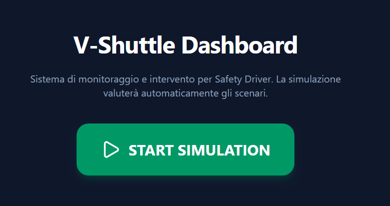
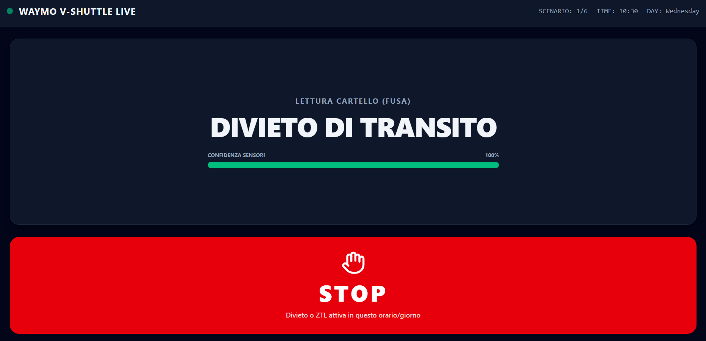
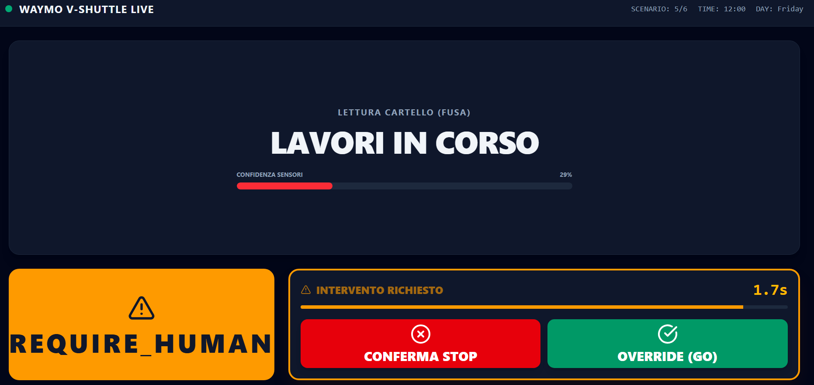
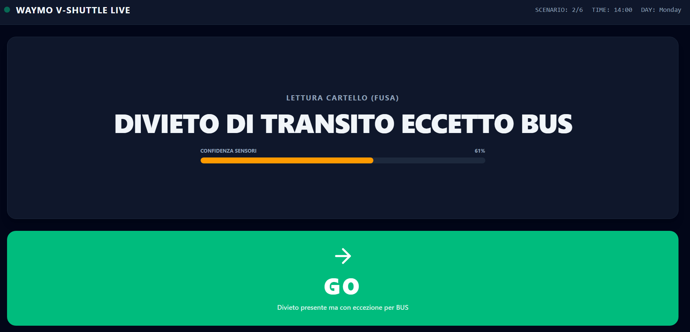
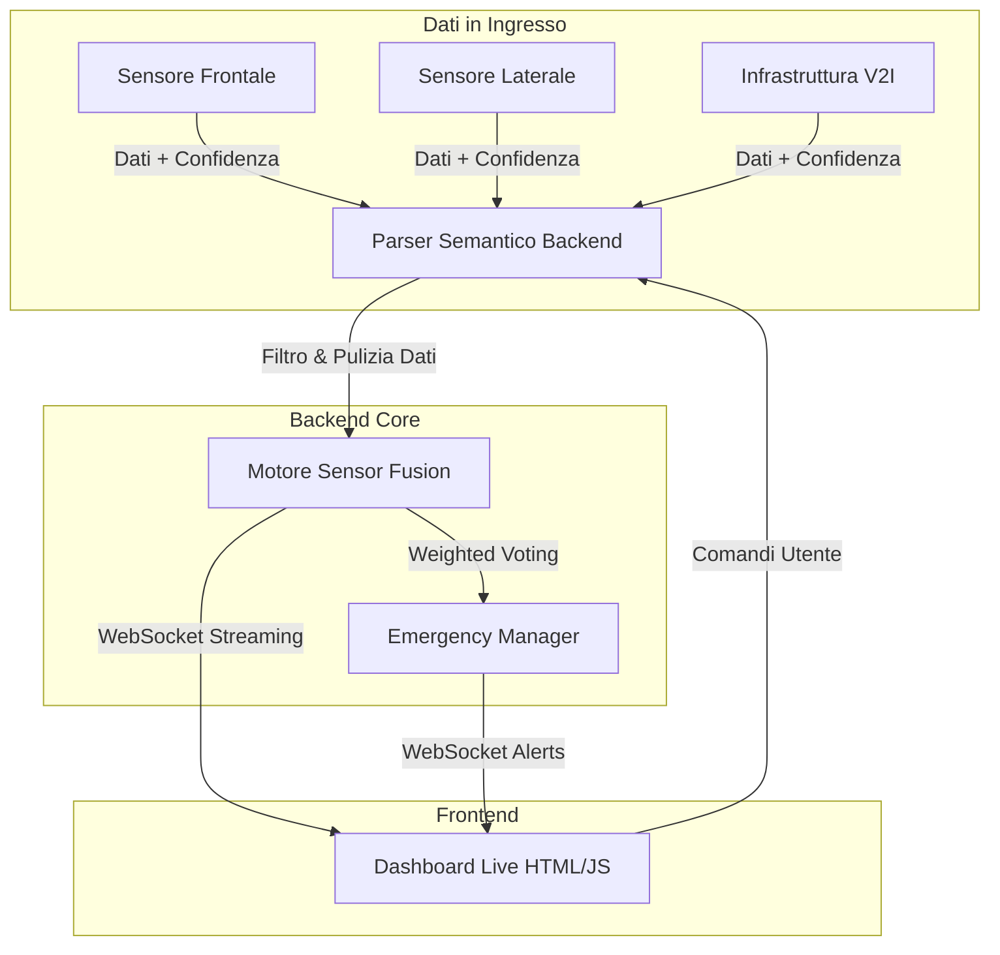

# Team 4 - V-Shuttle: Parser Semantico e Dashboard di Controllo

## 1. Autori
*   **Mattia Bonfiglio** -> Back End
*   **Tommaso Mussaldi** -> Front End
*   **Gregorio Panelli** -> Back End e Logica di Fusione dei Sensori

## 2. Descrizione del Progetto e Approccio

Il progetto **V-Shuttle** nasce con l'obiettivo di fornire una soluzione robusta, sicura e scalabile per il monitoraggio e il processo decisionale in tempo reale di navette a guida autonoma. Il problema centrale risolto dal sistema è l'interpretazione affidabile dell'ambiente circostante attraverso un **Parser Semantico** capace di elaborare e fondere flussi di dati eterogenei provenienti da tre fonti distinte: il **Sensore Frontale**, il **Sensore Laterale** e l'**Infrastruttura V2I**.

### Approccio
Per poter risolvere il problema abbiamo prima discusso ampliamente di quali fossero i requisiti software necessari e di come distribuire i compiti sul team di sviluppo. Siamo giunti alla conclusione che sarebbe stato necessario avere un back end in grado di elaborare la simulazione di ciò che sarebbe successo ricevendo i dati del file json fornito dal problema. 
Una parte importante di questo problema è decidere come elaborare i dati dei sensori e la loro affidabilità in modo che non si verifichi più il problema iniziale del *phantom braking*. Una volta elaborati i dati, questi sono comunicati al front end che si occupa di mostrarli al driver. Inoltre, si occupa di permettere l'inizio della simulazione e rendere possibile al driver dare la conferma o richiedere l'override nel caso in cui ce ne fosse il bisogno.

Una volta decisa la distribuzione dei compiti, abbiamo iniziato a sviluppare con l'aiuto degli LLM ognuno il proprio compito, confrontandoci man mano per assicurarci di rimanere coordinati. La maggior parte del tempo a noi dedicato (circa 3 ore e mezza) è stato concentrato sulla **progettazione di un prodotto robusto** e sull'utilizzo delle IA in modo estremamente mirato e preciso, per rimanere consapevoli di ogni scelta presa durante lo sviluppo.

*Nota sullo sviluppo dell'interfaccia:*
L'intenzione originale del team era di sostituire l'attuale interfaccia con una versione più avanzata e completa (il cui riferimento è contenuto nell'archivio `v-shuttle-dashboard.zip` nella cartella risorse), ma a causa dei rigidi limiti di tempo dell'Hackathon non siamo riusciti a completare l'integrazione di quel design specifico.

## 3. Struttura del Repository

Il repository è organizzato nelle seguenti cartelle principali:

*   **`back_end/`**: Contiene il codice sorgente Java dell'applicazione server.
    *   Gestisce la logica di business, il parsing dei dati e la comunicazione WebSocket.
    *   Le classi principali si trovano in `src/main/java/it/vshuttle/backend/`.
    *   Include il file `pom.xml` per la gestione delle dipendenze Maven.
*   **`front_end/`**: Contiene l'interfaccia utente web.
    *   `index.html`: La pagina principale della dashboard.
    *   `script/script.js`: Gestisce la connessione WebSocket con il backend e l'aggiornamento dinamico della UI.
    *   `css/style.css`: Fogli di stile per la presentazione.
*   **`shared_resources/`**: Risorse condivise e documentazione di supporto.
    *   File JSON di input per le simulazioni (`VShuttle-input.json`, `simulazione.json`).
    *   Documentazione sugli algoritmi (`algoritmo_confidenza.md`).
    *   Design system e risorse grafiche aggiuntive (`v-shuttle-dashboard.zip`).

## 4. Screenshot

> *Nota: Qui sotto è possibile vedere il design target che avremmo voluto implementare.*










## 5. Istruzioni di Avvio

Per avviare il sistema completo nel tuo ambiente locale, segui questi passaggi. Non sono necessari container Docker, ma è richiesto **Java JDK 17+** e **Maven**.

### Passo 1: Avvio del Backend
1.  Apri un terminale nella cartella `back_end`.
2.  Compila il progetto e installa le dipendenze:
    ```bash
    mvn clean install
    ```
3.  Avvia il server WebSocket:
    Puoi eseguire direttamente la classe principale `GuidaAutonomaWS` tramite il tuo IDE o da riga di comando (se il classpath è configurato correttamente), oppure eseguire il jar generato nella cartella `target`.
    
    Esempio di avvio rapido (se configurato con plugin exec):
    ```bash
    mvn exec:java"
    ```
    *Il server si avvierà in ascolto sulla porta 8080 (default).*

### Passo 2: Avvio del Frontend
1.  Naviga nella cartella `front_end`.
2.  Apri semplicemente il file `index.html`.
3.  La dashboard tenterà automaticamente di connettersi a `ws://localhost:8080` per ricevere i dati della simulazione.

## 6. Logica di Fusione dei Sensori

Il cuore del Parser Semantico è l'algoritmo di *Sensor Fusion*, implementato tramite una logica di **Weighted Confidence Voting** (Voto Pesato basato sull'Affidabilità).
Ogni sensore non si limita a inviare una misurazione ($D_i$), ma allega un indice di confidenza dinamico ($C_i$, compreso tra 0.0 e 1.0) calcolato in base alle condizioni esterne.

La decisione aggregata ($R$) non è una media aritmetica semplice, ma massimizza il peso dei sensori più "certi" della propria lettura, seguendo la formula logica trasposta nel codice:

$R = \frac{\sum (D_i \times C_i)}{\sum C_i}$

Il backend applica un filtro sui dati con confidenza insufficiente, garantendo che un sensore con segnale nitido abbia sempre la priorità.

## 7. Mappatura Edge Cases

La sicurezza delle navette a guida autonoma non ammette tolleranze per le anomalie. Il codice gestisce i casi limite seguendo rigidi paradigmi "fail-safe":

*   **Conflitto di Maggioranza:** Se sensori diversi danno letture discordanti, il sistema valuta il peso specifico di affidabilità. Se una lettura "minoritaria" rappresenta un pericolo immediato, la logica di fusione applica un override di sicurezza.
*   **Sensori Offline:** Se un sensore perde la connessione, viene escluso matematicamente dalla formula di fusione. Se troppi sensori vanno offline, il sistema innesca l'evento di *Emergency Stop*.

## 8. Schema Architetturale


Il flusso dei dati sfrutta un'architettura ibrida per garantire prestazioni in tempo reale. Le comunicazioni di stato passano tramite chiamate REST API, mentre la telemetria continua tra il Parser Semantico e la Dashboard fluisce su un tunnel **WebSocket** bidirezionale a bassa latenza.


