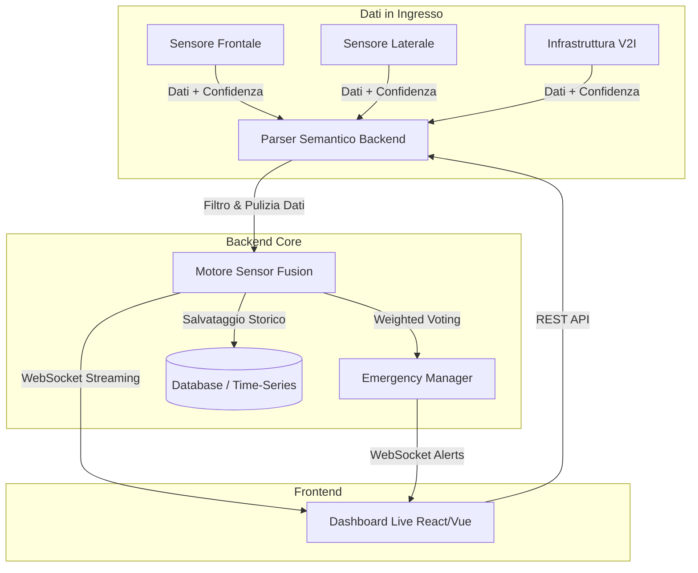

Ecco il README.md strutturato e formattato in Markdown secondo i criteri richiesti per il progetto "V-Shuttle".

---

# V-Shuttle: Dashboard Live e Parser Semantico

## 1. Descrizione del Progetto e Approccio

Il progetto **V-Shuttle** nasce con l'obiettivo di fornire una soluzione robusta, sicura e scalabile per il monitoraggio e il processo decisionale in tempo reale di navette a guida autonoma. Il problema centrale risolto dal sistema è l'interpretazione affidabile dell'ambiente circostante attraverso un **Parser Semantico** capace di elaborare e fondere flussi di dati eterogenei provenienti da tre fonti distinte: il **Sensore Frontale** (rilevamento ostacoli e distanza), il **Sensore Laterale** (prossimità e pedoni) e l'**Infrastruttura V2I** (Vehicle-to-Infrastructure per telemetria semaforica e stradale).

L'approccio architetturale si basa su uno stack moderno orientato alle prestazioni: un backend (es. Node.js/Python) dedicato all'ingestione e alla fusione algoritmica dei dati, e una **Dashboard Live** (es. React/Vue) per la visualizzazione immediata della telemetria, dello stato dei sensori e delle decisioni di routing prese dalla navetta, garantendo una user experience fluida e reattiva grazie all'aggiornamento a bassa latenza.

## 2. Visuals

Di seguito alcune anteprime dell'interfaccia di monitoraggio:

*Visualizzazione standard della Dashboard: i 3 sensori trasmettono dati correttamente e la navetta prosegue il percorso pianificato.*

*Visualizzazione in emergenza: rilevamento di un'anomalia sui sensori e conseguente riadattamento della confidenza del sistema.*

## 3. Setup Infallibile & Run Instructions

L'ambiente di sviluppo e produzione è interamente containerizzato per garantire l'assenza di conflitti e una riproducibilità totale su qualsiasi macchina. Assicurati di avere `Docker` e `Docker Compose` installati.

Per installare le dipendenze e avviare l'intero stack (Frontend, Backend, eventuale Database), esegui questi esatti comandi nel terminale:

```bash
# 1. Clona il repository in locale
git clone https://github.com/Karma177/TeamNumero4-VShuttle.git
cd TeamNumero4-VShuttle

# 2. Crea il file delle variabili d'ambiente a partire dall'esempio fornito
cp .env.example .env

# 3. Costruisci le immagini Docker e avvia i container in modalità detached
docker-compose up --build -d

# 4. Verifica che non ci siano errori nei log di avvio
docker-compose logs -f

```

Una volta terminato l'avvio, la Dashboard Live sarà raggiungibile all'indirizzo `http://localhost:3000`, mentre i servizi di backend risponderanno su `http://localhost:8080`.

## 4. Logica di Fusione dei Sensori

Il cuore del Parser Semantico è l'algoritmo di *Sensor Fusion*, implementato tramite una logica di **Weighted Confidence Voting** (Voto Pesato basato sull'Affidabilità).
Ogni sensore non si limita a inviare una misurazione ($D_i$), ma allega un indice di confidenza dinamico ($C_i$, compreso tra 0.0 e 1.0) calcolato in base alle condizioni esterne (es. meteo, latenza del segnale).

La decisione aggregata ($R$) non è una media aritmetica semplice, ma massimizza il peso dei sensori più "certi" della propria lettura, seguendo la formula logica trasposta nel codice:

$R = \frac{\sum (D_i \times C_i)}{\sum C_i}$

Il backend applica innanzitutto un filtro passa-alto: i dati con un indice di confidenza inferiore a una specifica soglia di sicurezza (es. $C_i < 0.3$) vengono automaticamente scartati. Sui dati rimanenti viene applicato il calcolo pesato, garantendo che un sensore con segnale nitido abbia sempre la priorità su uno parzialmente oscurato.

## 5. Mappatura Edge Cases

La sicurezza delle navette a guida autonoma non ammette tolleranze per le anomalie. Il codice gestisce i casi limite seguendo rigidi paradigmi "fail-safe":

* **Conflitto di Maggioranza (Es: 2 sensori rilevano A, 1 rileva B):**
Se il Sensore Frontale e il V2I concordano (Strada Libera) ma il Sensore Laterale è in disaccordo (Ostacolo Rilevato), il codice valuta il peso specifico di affidabilità combinata. Tuttavia, per via delle regole intrinseche di safety, se la lettura "minoritaria" rappresenta un pericolo immediato (falso positivo potenziale su un ostacolo), la logica di fusione applica un override di sicurezza e attiva la decelerazione del veicolo. Il "Majority Voting" vince solo in caso di decisioni a pari livello di rischio.
* **Sensori Offline o Valori Nulli:**
Se un sensore perde la connessione o invia un payload nullo, l'event handler cattura l'eccezione assegnando forzatamente a quel sensore un livello di confidenza pari a $0.0$. Questo lo esclude matematicamente dalla formula di fusione per evitare divisioni per zero o inquinamento dei dati. Se il numero di sensori attivi e con confidenza $> 0.0$ scende al di sotto di $2$, il sistema innesca immediatamente l'evento di *Emergency Stop* per arrestare la navetta.

## 6. Schema Architetturale

Il flusso dei dati sfrutta un'architettura ibrida per garantire prestazioni in tempo reale. Le comunicazioni di stato passano tramite chiamate REST API, mentre la telemetria continua tra il Parser Semantico e la Dashboard fluisce su un tunnel **WebSocket** bidirezionale a bassa latenza.

